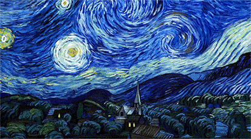
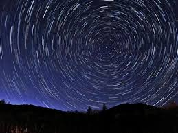
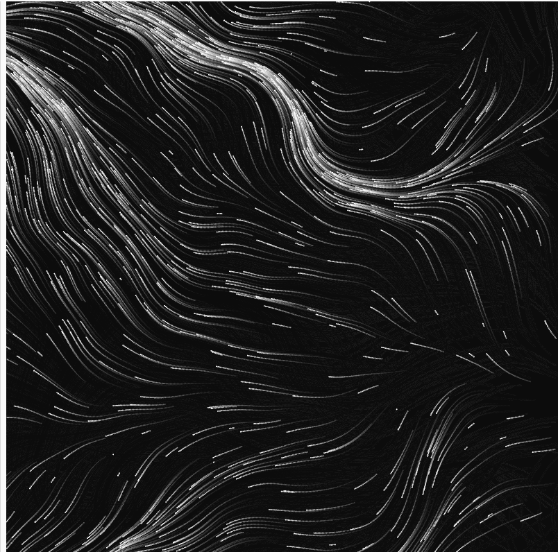

# Ywan0291_Quiz 8
## Imaging Technique Inspiration
### Movement of Light and Shadow

I found inspiration for my final project from the movie "Loving Vincent" and star trail photography. Both works contain the trajectory of light and shadow movement. I think animating the light and shadow of artwork can make the artwork more dynamic while better complementing the background music. For example, the speed of the light and shadow flow could be determined by the tempo of the music.


  

## Coding Technique Exploration
### Perlin Noise Flow

The technique I found uses Perlin noise to generate. 
Perlin noise can be used for any type of wave-like materials or textures. With Perlin noise, this code can generate several lines that change their flow based on music or mouse clicks. I think this code can well represent the light and shadow techniques of Impressionism and the flowing trails of the starry sky.



[Code Link](https://editor.p5js.org/BarneyCodes/sketches/2eES4fBEL)

> This is the code I found.
```
let particles = [];
const num = 1000;

const noiseScale = 0.01/2;

function setup() {
  createCanvas(400, 400);
  for(let i = 0; i < num; i ++) {
    particles.push(createVector(random(width), random(height)));
  }
  
  stroke(255);
  // For a cool effect try uncommenting this line
  // And comment out the background() line in draw
  // stroke(255, 50);
  clear();
}

function draw() {
  background(0, 10);
  for(let i = 0; i < num; i ++) {
    let p = particles[i];
    point(p.x, p.y);
    let n = noise(p.x * noiseScale, p.y * noiseScale, frameCount * noiseScale * noiseScale);
    let a = TAU * n;
    p.x += cos(a);
    p.y += sin(a);
    if(!onScreen(p)) {
      p.x = random(width);
      p.y = random(height);
    }
  }
}

function mouseReleased() {
  noiseSeed(millis());
}

function onScreen(v) {
  return v.x >= 0 && v.x <= width && v.y >= 0 && v.y <= height;
}
```
